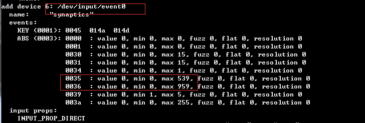
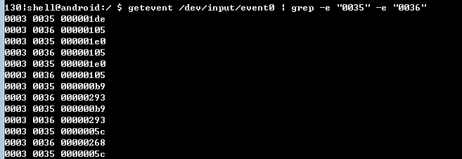

 
## Android shell auto test ##

###  步骤 ###
- A root device
- Install busybox ( download busybox pro.apk )
- Edit shell script and push to device
- excute cmd : 	`nohup ./xxx.sh &` ( nohup是永久执行,&是指在后台运行 )

### 获取标记点击坐标 ###

- 查看哪个设备包含event 体系里 宽（0035）和高（0036）

		getevent -p 

	
	
	rateW = 540(手机屏幕的宽) / 539(event里0035的max) ≈ 1
	
	rateH = 960(手机屏幕的高) / 959(event里0036的max) ≈ 1

- 监听设备点击坐标

		getevent device name | grep -e "0035" -e "0036"

	

	把0035和0036后面的位置数据从16进制转化为10进制 
		
		width = 0x14e = 1*16*16 + 4*16 + 14 = 334 
		height = 0x2c1 = 2*16*16 + 12*16 + 1 = 705 
	
	这是在event体系里的位置，将其转化为屏幕位置 
	
		screenW = width*rateW = 334*1 = 334 
		screenH = height*rateH = 705*1 = 705
 
### 发送事件 ###

后台抓取日志

	logcat -b main -b system -b radio -b events  -vtime >logcat.log &

android4.0 其以下版本：

	usage: input [text|keyevent]
       input text <string>
       input keyevent <event_code>

android5.0及其以上版本：

	Usage: input [<source>] <command> [<arg>...]
	
	The sources are:
	      keyboard
	      mouse
	      joystick
	      touchnavigation
	      touchpad
	      trackball
	      dpad
	      stylus
	      gamepad
	      touchscreen
	
	The commands and default sources are:
	      text <string> (Default: touchscreen)
	      keyevent [--longpress] <key code number or name> ... (Default: keyboard)
	      tap <x> <y> (Default: touchscreen)
	      swipe <x1> <y1> <x2> <y2> [duration(ms)] (Default: touchscreen)
	      press (Default: trackball)
	      roll <dx> <dy> (Default: trackball)